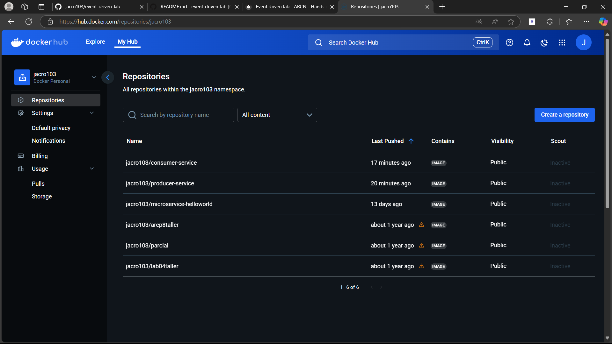
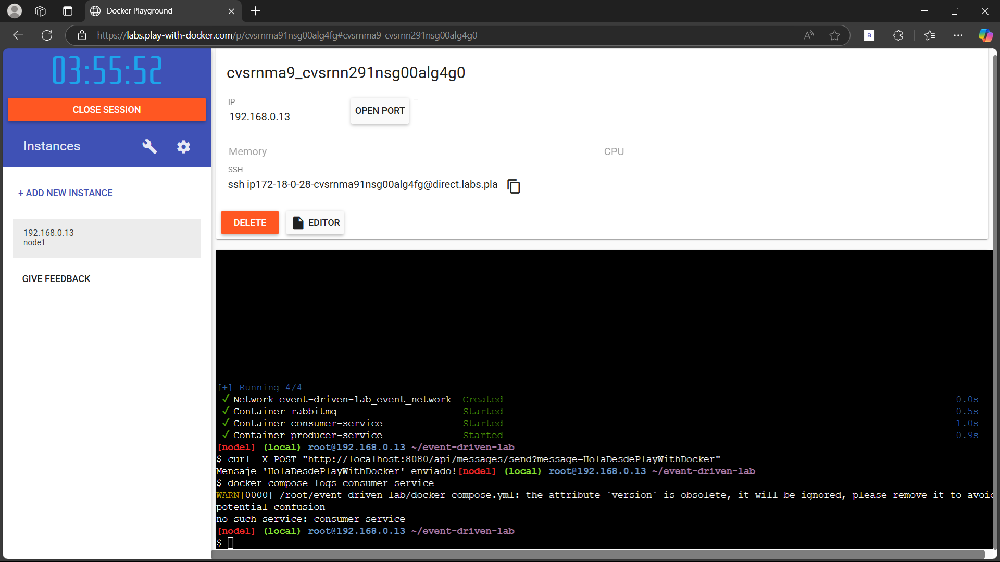
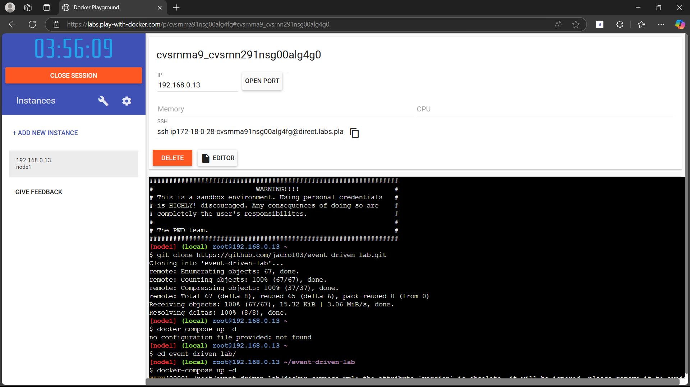

# BEvent_Driven_Lab

# Crear el Servicio Productor (Spring Boot)

Este laboratorio permite configurar un entorno de desarrollo en GitHub Codespaces para ejecutar Servicio Productor

## 1. Crear un nuevo repositorio en GitHub
1. Ve a GitHub y crea un nuevo repositorio.
2. Asigna un nombre y una descripción a tu repositorio.

## 2. Configurar GitHub Codespaces
### Crear un nuevo archivo de configuración
1. En la raíz del repositorio, crea la carpeta `.devcontainer`.
2. Dentro de esta carpeta, crea un archivo `devcontainer.json`.
3. Pega la siguiente configuración:

4. Confirma los cambios (`Commit changes...`).

## 3. Crear Codespace
1. Ve a la página principal del repositorio y haz clic en `<> Code`.
2. En la pestaña `Codespaces`, haz clic en `Create codespace on main`.

## 4 . Seguir las instrucciones del lab
 
 
 

## Autor

Jose Alejandro Correa Rodriguez

